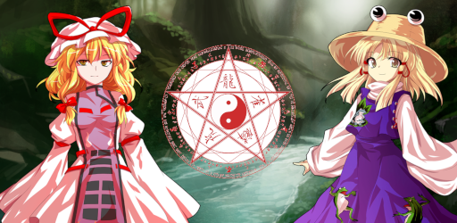
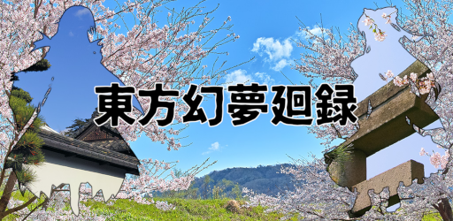
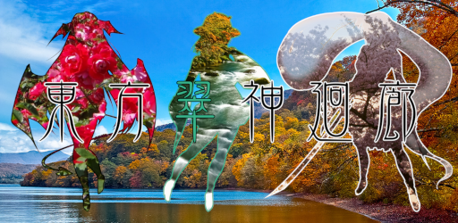

<!--

-->

<!--

-->

## 👋 Hi there
I'm T.D(TD12734)

I work as a web IT engineer.

I also create games as a hobby.

## 🌱 My skills

## 🎮 My Games
I created a Touhou Project fan games using Unity.

###  東方魔法陣連打(Touhou Mahoujinrenda)

This is my first game.

Click on the magic square to strengthen your allies, or click on enemies to defeat them.

###  東方幻夢廻録(Touhou Genmukairoku)

This is my second game.

More than 100 characters will be friends.

In this game we organize a party of seven people and defeat the enemy.
Battle will advance automatically.

###  東方翠神廻廊(Touhou Suijinkairou)

This is my third game.

This game is a Touhou derivative RPG featuring over 150 fantasy girls.
Explore the corridors and solve the strange situation in Gensokyo.
A profound story unfolds, and your choices will change the future.

 

## 📨 Contact me
**[Twitter - @TD12734](https://twitter.com/TD12734)**
